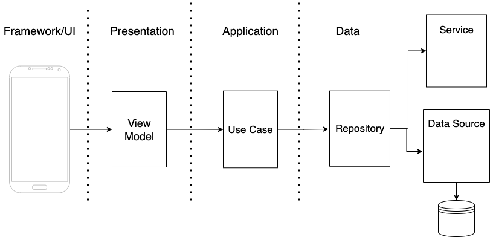
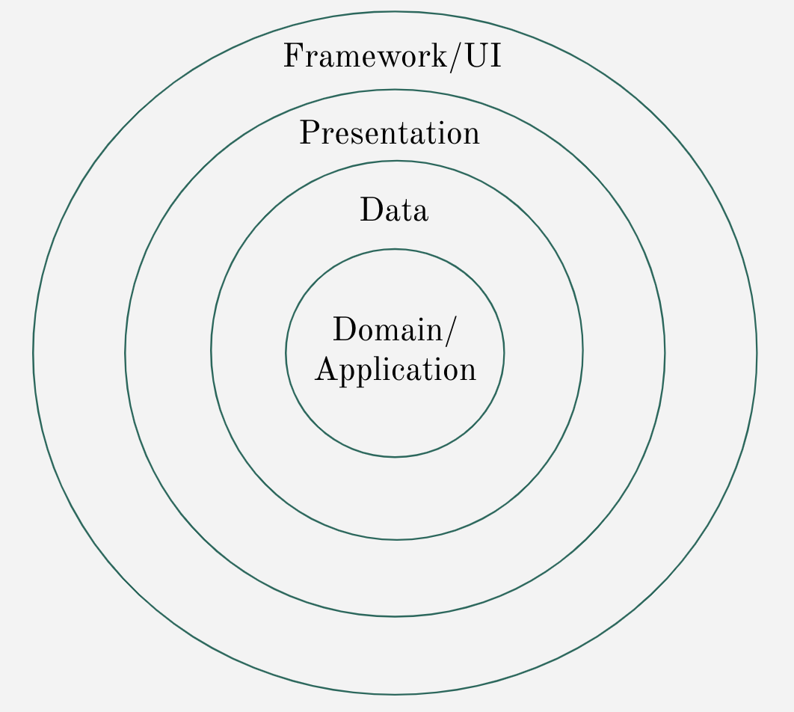

# DailyPulse

Daily Pulse includes a native Android and a native iOS apps, where the business logic and
infrastructure is shared in a KMP module.

Daily Pulse is using the news API to fetch, cache and display the top US business articles. It also
contains a screen to display the list of news sources we use to fetch the articles from.
Finally, it contains third screen to display information regarding the user's device.

## App Demo 

<video src="https://github.com/user-attachments/assets/7cd78a4f-157d-4b82-b0db-4393aa1bbaa6" width="300" />

## Tech Stack

It is a prototype app based on the following technologies and patterns:

1. Clean Architecture
2. MVI
3. Ktor
4. SQL Delight
5. Koin
6. Jetpack Compose
7. Swift UI

## Architectural diagram

The UI/Framework layers reside in the native apps, while everything from the View Model up to Data
layer is in the common KMP module.



## Architectural Layers




License
--------

```
  Copyright (C) 2024 Abdul Wahab Open Source Project

  Licensed under the Apache License, Version 2.0 (the "License");
  you may not use this file except in compliance with the License.
  You may obtain a copy of the License at

        http://www.apache.org/licenses/LICENSE-2.0

  Unless required by applicable law or agreed to in writing, software
  distributed under the License is distributed on an "AS IS" BASIS,
  WITHOUT WARRANTIES OR CONDITIONS OF ANY KIND, either express or implied.
  See the License for the specific language governing permissions and
  limitations under the License.
  ```

